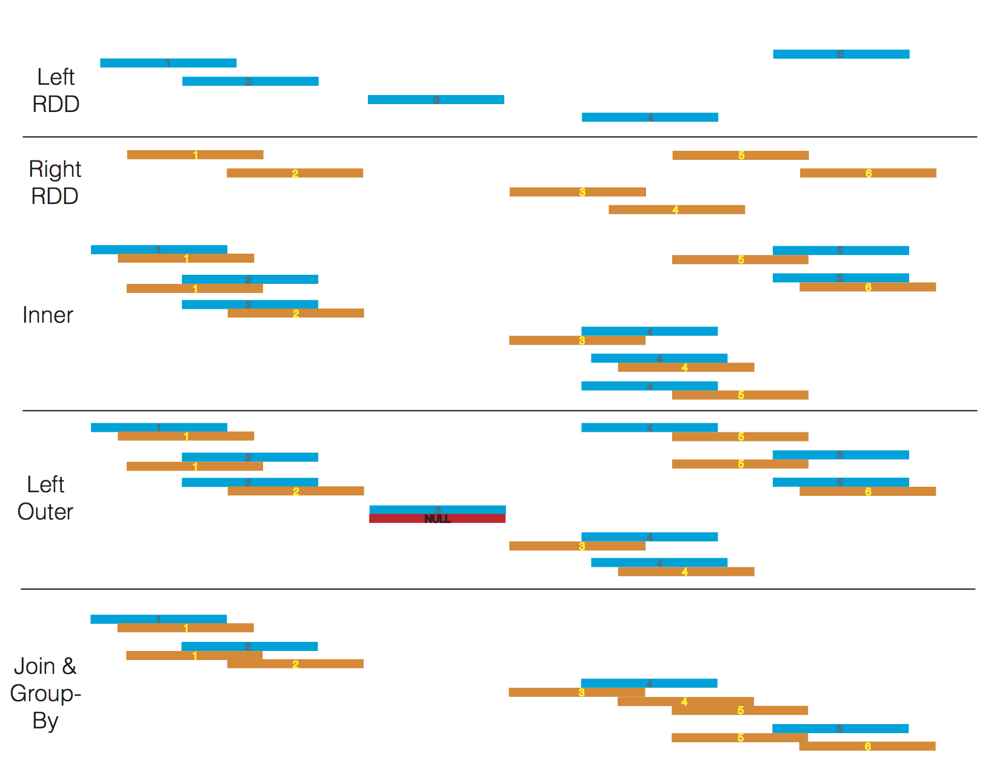

Using ADAM's RegionJoin API
---------------------------

Another useful API implemented in ADAM is the RegionJoin API, which
joins two genomic datasets that contain overlapping regions. This
primitive is useful for a number of applications including variant
calling (identifying all of the reads that overlap a candidate variant),
coverage analysis (determining the coverage depth for each region in a
reference), and INDEL realignment (identify INDELs aligned against a
reference).

There are two overlap join implementations available in ADAM:
BroadcastRegionJoin and ShuffleRegionJoin. The result of a
ShuffleRegionJoin is identical to the BroadcastRegionJoin, however they
serve different purposes depending on the content of the two datasets.

The ShuffleRegionJoin is a distributed sort-merge overlap join. To
ensure that the data are appropriately colocated, we perform a
copartition on the right dataset before the each node conducts the join
locally. ShuffleRegionJoin should be used if the right dataset is too
large to send to all nodes and both datasets have high cardinality.

The BroadcastRegionJoin performs an overlap join by broadcasting a copy
of the entire left dataset to each node. The BroadcastRegionJoin should
be used when the right side of your join is small enough to be collected
and broadcast out, and the larger side of the join is unsorted and the
data are too large to be worth shuffling, the data are sufficiently
skewed that it is hard to load balance, or you can tolerate unsorted
output.

Another important distinction between ShuffleRegionJoin and
BroadcastRegionJoin is the join operations available in ADAM. Since the
broadcast join does not co-partition the datasets and instead sends the
full right table to all nodes, some joins (e.g. left/full outer joins)
cannot be written as broadcast joins. See the table below for an exact
list of what joins are available for each type of region join.

To perform a ShuffleRegionJoin, use the following:

.. code:: scala

    dataset1.shuffleRegionJoin(dataset2)

To perform a BroadcastRegionJoin, use the following:

.. code:: scala

    dataset1.broadcastRegionJoin(dataset2)

Where ``dataset1`` and ``dataset2`` are ``GenomicDataset``\ s. If you used
the ADAMContext to read a genomic dataset into memory, this condition is
met.

ADAM has a variety of region join types that you can perform on your
data, and all are called in a similar way:

-  Joins implemented across both shuffle and broadcast

   -  Inner join
   -  Right outer join

-  Shuffle-only joins

   -  Full outer join
   -  Inner join and group by left
   -  Left outer join
   -  Right outer join and group by left

-  Broadcast-only joins

   -  Inner join and group by right
   -  Right outer join and group by right

Given two GenomicDatasets

.. figure:: img/join_rdds.png
   :alt: Genomic Datasets for Joins

A subset of these joins are depicted below.

One common pattern involves joining a single dataset against many
datasets. An example of this is joining an genomic dataset of features (e.g.,
gene/exon coordinates) against many different genomic datasets of reads. If the
object that is being used many times (gene/exon coordinates, in this
case), we can force that object to be broadcast once and reused many
times with the ``broadcast()`` function. This pairs with the
``broadcastRegionJoin`` and ``rightOuterBroadcastRegionJoin`` functions.
For example, given the following code:

.. code:: scala

    val reads = sc.loadAlignments("my/reads.adam")
    val features = sc.loadFeatures("my/features.adam")

    val readsByFeature = features.broadcastRegionJoin(reads)

We can get a handle to the broadcast features by rewriting the code as:

.. code:: scala

    val reads = sc.loadAlignments("my/reads.adam")
    val bcastFeatures = sc.loadFeatures("my/features.adam").broadcast()

    val readsByFeature = reads.broadcastRegionJoinAgainst(bcastFeatures)

To demonstrate how the RegionJoin APIs can be used to answer scientific
questions, we will walk through three common queries that can be written
using the RegionJoin API. First, we will perform a simple filter on
genotypes based on a file of features. We will then demonstrate a join
and group by on variants and features, providing variant data grouped by
the feature they overlap. Finally, we will separate reads into those
that overlap and those that do not overlap features from a feature file.

These demonstrations illustrate the difference between calling
ShuffleRegionJoin and BroadcastRegionJoin and provide example code to
expand from.

Filter Genotypes by Features
~~~~~~~~~~~~~~~~~~~~~~~~~~~~

This query joins a genomic dataset of Genotypes against a genomic dataset of Features using an
inner join. Because this is an inner join, records from either dataset
that do not pair to the other are automatically dropped, providing the
filter we are interested in. This query is useful for trying to identify
genotypes that overlap features of interest. For example, if our feature
file contains all the exonic regions of the genome, this query would
extract all genotypes that fall in exonic regions.

.. code:: scala

    // Inner join will filter out genotypes not covered by a feature
    val genotypes = sc.loadGenotypes("my/genotypes.adam")
    val features = sc.loadFeatures("my/features.adam")

    // We can use ShuffleRegionJoin…
    val joinedGenotypesShuffle = genotypes.shuffleRegionJoin(features)

    // …or BroadcastRegionJoin
    val joinedGenotypesBcast = features.broadcastRegionJoin(genotypes)

    // In the case that we only want Genotypes, we can use a simple projection
    val filteredGenotypesShuffle = joinedGenotypesShuffle.rdd.map(_._1)

    val filteredGenotypesBcast = joinedGenotypesBcast.rdd.map(_._2)

After the join, we can perform a transform function on the resulting RDD
to manipulate it into providing the answer to our question. Since we
were interested in the ``Genotype``\ s that overlap a ``Feature``, we
map over the tuples and select just the ``Genotype``.

Since a broadcast join sends the left dataset to all executors, we chose
to send the ``features`` dataset because feature data are usually
smaller in size than genotypic data.

Group overlapping variant data by the gene they overlap
~~~~~~~~~~~~~~~~~~~~~~~~~~~~~~~~~~~~~~~~~~~~~~~~~~~~~~~

This query joins a genomic dataset of Variants against a genomic dataset of Features, and
immediately performs a group-by on the Feature. This produces a genomic dataset
whose elements are a tuple containing a Feature, and all of the Variants
overlapping the Feature. This produces an RDD whose elements are tuples
containing a Feature and all of the Variants overlapping the
Feature. This query is useful for trying to identify annotated variants
that may interact (identifying frameshift mutations within a transcript
that may act as a pair to shift and then restore the reading frame) or
as the start of a query that computes variant density over a set of
genomic features.

.. code:: scala

    // Inner join with a group by on the features
    val features = sc.loadFeatures("my/features.adam")
    val variants = sc.loadVariants("my/variants.adam")

    // As a ShuffleRegionJoin, it can be implemented as follows:
    val variantsByFeatureShuffle = features.shuffleRegionJoinAndGroupByLeft(variants)

    // As a BroadcastRegionJoin, it can be implemented as follows:
    val variantsByFeatureBcast = variants.broadcastRegionJoinAndGroupByRight(features)

When we switch join strategies, we swap which dataset is on the left
side of the join. BroadcastRegionJoin only supports grouping by the
right dataset, and ShuffleRegionJoin supports only grouping by the left
dataset.

The reason BroadcastRegionJoin does not have a ``joinAndGroupByLeft``
implementation is due to the fact that the left dataset is broadcast to
all nodes. Unlike shuffle joins, broadcast joins do not maintain a sort
order invariant. Because of this, we would need to shuffle all data to a
group-by on the left side of the dataset, and there is no opportunity to
optimize by combining the join and group-by.

Separate reads into overlapping and non-overlapping features
~~~~~~~~~~~~~~~~~~~~~~~~~~~~~~~~~~~~~~~~~~~~~~~~~~~~~~~~~~~~

This query joins a genomic dataset of reads with a genomic dataset of features using an outer
join. The outer join will produce an RDD where each read is optionally
mapped to a feature. If a given read does not overlap with any features
provided, it is paired with a ``None``. After we perform the join, we
use a predicate to separate the reads into two RDDs. This query is
useful for filtering out reads based on feature data. For example,
identifying reads that overlap with ATAC-seq data to perform chromatin
accessibility studies. It may be useful to separate the reads to perform
distinct analyses on each resulting dataset.

.. code:: scala

    // An outer join provides us with both overlapping and non-overlapping data
    val reads = sc.loadAlignments("my/reads.adam")
    val features = sc.loadFeatures("my/features.adam")

    // As a ShuffleRegionJoin, we can use a LeftOuterShuffleRegionJoin:
    val readsToFeatures = reads.leftOuterShuffleRegionJoin(features)

    // As a BroadcastRegionJoin, we can use a RightOuterBroadcastRegionJoin:
    val featuresToReads = features.rightOuterBroadcastRegionJoin(reads)

    // After we have our join, we need to separate the RDD
    // If we used the ShuffleRegionJoin, we filter by None in the values
    val overlapsFeatures = readsToFeatures.rdd.filter(_._2.isDefined)
    val notOverlapsFeatures = readsToFeatures.rdd.filter(_._2.isEmpty)

    // If we used BroadcastRegionJoin, we filter by None in the keys
    val overlapsFeatures = featuresToReads.rdd.filter(_._1.isDefined)
    val notOverlapsFeatures = featuresToReads.rdd.filter(_._1.isEmpty)

Because of the difference in how ShuffleRegionJoin and
BroadcastRegionJoin are called, the predicate changes between them. It
is not possible to call a ``leftOuterJoin`` using the
BroadcastRegionJoin. As previously mentioned, the BroadcastRegionJoin
broadcasts the left dataset, so a left outer join would require an
additional shuffle phase. For an outer join, using a ShuffleRegionJoin
will be cheaper if your reads are already sorted, however if the feature
dataset is small and the reads are not sorted, the BroadcastRegionJoin
call would likely be more performant.

