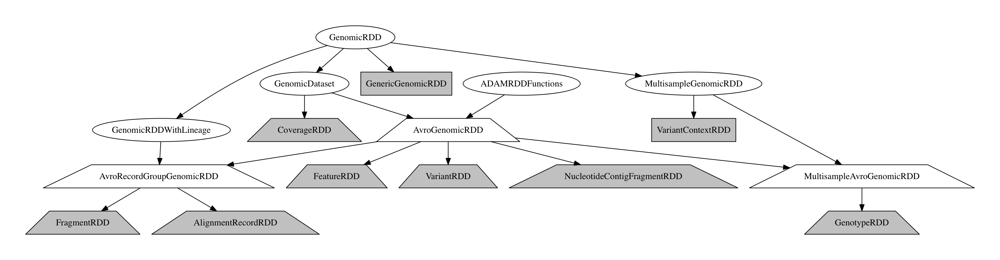

Interacting with data through ADAM's evidence access layer
----------------------------------------------------------

ADAM exposes access to distributed datasets of genomic data through the
`ADAMContext <../api/adamContext.html>`__ entrypoint. The ADAMContext wraps Apache
Spark's SparkContext, which tracks the configuration and state of the
current running Spark application. On top of the SparkContext, the
ADAMContext provides data loading functions which yield
`GenomicDataset <../api/genomicDataset.html>`__\ s. The GenomicDataset classes provide a
wrapper around Apache Spark's two APIs for manipulating distributed
datasets: the legacy Resilient Distributed Dataset (Zaharia et al. 2012)
and the new Spark SQL Dataset/DataFrame API (Armbrust et al. 2015).
Additionally, the GenomicDataset is enriched with genomics-specific metadata
such as computational lineage and sample metadata, and optimized
genomics-specific query patterns such as `region joins <../api/joins.html>`__ and
the `auto-parallelizing pipe API <../api/pipes.html>`__ for running legacy tools
using Apache Spark.

   The GenomicDataset Class Hierarchy

All GenomicDatasets include a sequence dictionary which describes the
reference genome that the data in the genomic dataset are aligned to, if one is
known. Additionally, ReadGroupGenomicDataset store a dictionary with read
groups that are attached to the reads/fragments. Similarly, the
MultisampleGenomicDataset includes a list of samples who are present in the
dataset.
