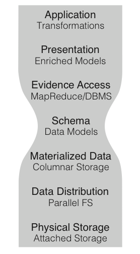

The ADAM Stack Model
--------------------

The stack model that ADAM is based upon was introduced in (Massie et al.
2013) and further refined in (F. A. Nothaft et al. 2015), and is
depicted in the figure below. This stack model separates computational
patterns from the data model, and the data model from the serialized
representation of the data on disk. This enables developers to write
queries that run seamlessly on a single node or on a distributed
cluster, on legacy genomics data files or on data stored in a high
performance columnar storage format, and on sorted or unsorted data,
without making any modifications to their query. Additionally, this
allows developers to write at a higher level of abstraction without
sacrificing performance, since we have the freedom to change the
implementation of a layer of the stack in order to improve the
performance of a given query.

   The ADAM Stack Model

This stack model is divided into seven levels. Starting from the bottom,
these are:

1. The *physical storage* layer is the type of storage media (e.g., hard
   disk/solid state drives) that are used to store the data.
2. The *data distribution* layer determines how data are made accessible
   to all of the nodes in the cluster. Data may be made accessible
   through a POSIX-compliant shared file system such as NFS (Sandberg et
   al. 1985), a non-POSIX file system that implements Hadoop's APIs
   (e.g., HDFS), or through a block-store, such as Amazon S3.
3. The *materialized data* layer defines how the logical data in a
   single record maps to bytes on disk. We advocate for the use of
   `Apache Parquet <https://parquet.apache.org>`__, a high performance
   columnar storage format based off of Google's Dremel database (Melnik
   et al. 2010). To support conventional genomics file formats, we
   exchange the Parquet implementation of this layer with a layer that
   maps the given schema into a traditional genomics file format (e.g.,
   SAM/BAM/CRAM, BED/GTF/GFF/NarrowPeak, VCF).
4. The *schema* layer defines the logical representation of a datatype.
5. The *evidence access* layer is the software layer that implements and
   executes queries against data stored on disk. While ADAM was
   originally built around Apache Spark's Resilient Distributed Dataset
   (RDD) API (Zaharia et al. 2012), ADAM has recently enabled the use of
   Spark SQL (Armbrust et al. 2015) for evidence access and query.
6. The *presentation* layer provides high level abstractions for
   interacting with a parallel collection of genomic data. In ADAM, we
   implement this layer through the `GenomicDataset <../api/genomicDataset.html>`__
   classes. This layer presents users with a view of the metadata
   associated with a collection of genomic data, and APIs for
   `transforming <../api/genomicRdd.html#transforming-genomicdatasets>`__ and
   `joining <../api/joins.html>`__ genomic data. Additionally, this is the
   layer where we provide cross-language support.
7. The *application* layer is the layer where a user writes their
   application on top of the provided APIs.

Our stack model derives its inspiration from the layered Open Systems
Interconnection (OSI) networking stack (Zimmermann 1980), which
eventually served as the inspiration for the Internet Protocol stack,
and from the concept of data independence in database systems. We see
this approach as an alternative to the "stack smashing" commonly seen in
genomics APIs, such as the GATK's "walker" interface (McKenna et al.
2010). In these APIs, implementation details about the layout of data on
disk (are the data sorted?) are propagated up to the application layer
of the API and exposed to user code. This limits the sorts of queries
that can be expressed efficiently to queries that can easily be run
against linear sorted data. Additionally, these "smashed stacks"
typically expose very low level APIs, such as a sorted iterator, which
increases the cost to implementing a query and can lead to trivial
mistakes.

