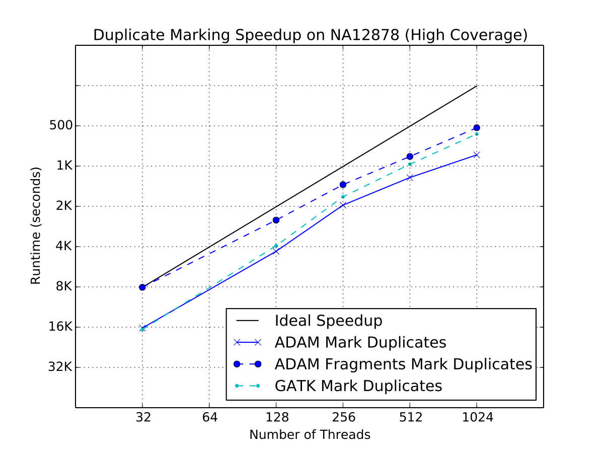

Benchmarks
==========

Algorithm Performance
---------------------

To test the efficiency of ADAM's implementations of the various
algorithms that are used in our variant calling pipeline, we ran strong
scaling experiments. In this experiment, we used the high coverage
genome NA12878 from the 1000 Genomes project. We held the executor
configuration constant, and stepped from one to four executors before
doubling until we reached 32 executors. Each executor had 16
hyperthreaded cores (32 concurrent threads) and was allocated 200
gigabytes of memory.

In general, most of the algorithms in ADAM scale linearly as the amount
of compute resources is increased. The significant exception is BQSR,
which is explained by the large broadcast which runs during BQSR. The
broadcast introduces a serial step that runs for several minutes, as the
multiple gigabyte mask table is broadcast to all of the nodes in the
cluster. The figures below break these results down and compares them to
the latest implementation of these algorithms in the GATK4.

   Strong scaling characteristics of duplicate marking

   Strong scaling characteristics of base quality recalibration

   Strong scaling characteristics of INDEL Realignment

As our benchmarks demonstrate, ADAM's implementations of the various
algorithms in the standard germline reads-to-variants pipeline are more
performant than the same algorithms implemented in the GATK4. ADAM
outperforms the GATK when running equivalent implementations of
BQSR (1.4x speedup) and duplicate
marking (1.1x speedup). To improve the performance of
duplicate marking, we added a variant of the duplicate marking algorithm
that operates on reads that are grouped by sequencing fragment. By
optimizing for reads that are grouped with the other reads from their
fragment, we can eliminate the first shuffle in duplicate marking, which
reassembles reads by read-pair. This optimization is common in duplicate
markers, as paired-end aligners will typically emit a SAM or BAM file
where consecutive reads are from the same sequencing fragment.
