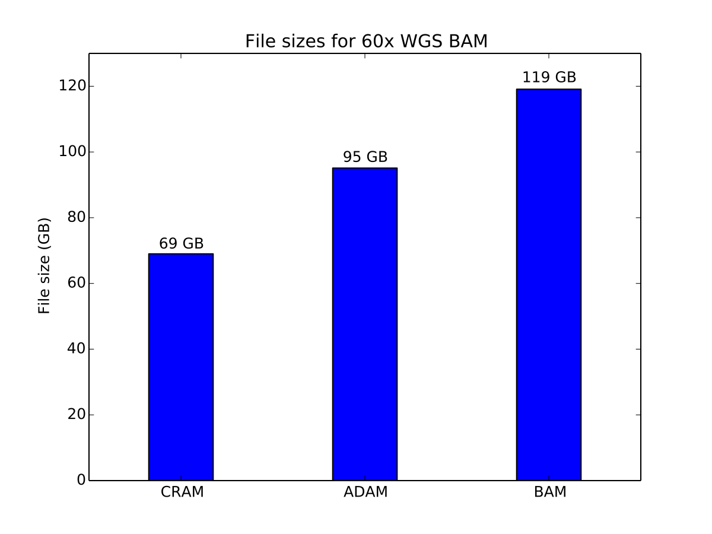

Storage Size
------------

ADAM uses `Apache Parquet <https://parquet.apache.org>`__ as a way to
store genomic data. This is in addition to our support for conventional
genomic file formats. Parquet is an efficient columnar storage system
that is widely used in the analytics ecosystem, and integrates with a
variety of data management tools and query engines. Parquet provides
improved storage capacity relative to several conventional genomics data
storage formats. Here, we look at the storage cost of aligned reads,
features, and variants.

Aligned Reads
~~~~~~~~~~~~~

In this benchmark, we have stored a copy of NA12878 aligned to the
GRCh37 reference genome using BWA. We store this genome in BAM, CRAM,
and ADAM, using the default compression settings for each. BAM and CRAM
files were generated using htslib. This read file was sequenced at
approximately 60x coverage across the whole genome.

   Storage cost of a 60x coverage WGS aligned dataset

ADAM provides a 20% improvement in storage size over BAM, while CRAM
achieves a 43% improvement in storage cost. CRAM achieves a higher
compression ratio by using reference-based compression techniques to
minimize the amount of data stored on disk.

Features
~~~~~~~~

Here, we benchmark both the GFF3 and BED formats. For GFF3, we use the
ENSEMBL GRCh38 genome annotation file. For BED, we use genome-wide
coverage counts generated from the NA12878 dataset used in the `aligned
read benchmarks <#aligned-reads-storage>`__.

   Storage cost of genome annotations

For the genome annotation file, ADAM provides a 20% improvement in
storage size relative to the compressed GFF3 file.

   Storage cost of coverage data

For the coverage data, ADAM provides a 45% improvement in storage size
relative to the compressed BED file.

Genomic Variants
~~~~~~~~~~~~~~~~

In this benchmark, we used the 1,000 Genomes phase 3 data release VCFs.
We compared GZIP-compressed VCF and uncompressed VCF to ADAM.

   Storage cost of variant data

Compressed VCF is approximately 10% smaller than genotype data stored as
Parquet.
