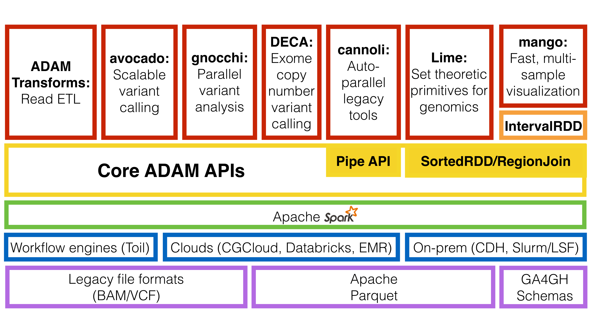

ADAM User Guide
===============

Introduction
============

ADAM is a library and command line tool that enables the use of `Apache
Spark <https://spark.apache.org>`__ to parallelize genomic data analysis
across cluster/cloud computing environments. ADAM uses a set of schemas
to describe genomic sequences, reads, variants/genotypes, and features,
and can be used with data in legacy genomic file formats such as
SAM/BAM/CRAM, BED/GFF3/GTF, and VCF, as well as data stored in the
columnar `Apache Parquet <https://parquet.apache.org>`__ format. On a
single node, ADAM provides competitive performance to optimized
multi-threaded tools, while enabling scale out to clusters with more
than a thousand cores. ADAM's APIs can be used from Scala, Java, Python,
R, and SQL.

The ADAM/Big Data Genomics Ecosystem
------------------------------------

ADAM builds upon the open source `Apache
Spark <https://spark.apache.org>`__, `Apache
Avro <https://avro.apache.org>`__, and `Apache
Parquet <https://parquet.apache.org>`__ projects. Additionally, ADAM can
be deployed for both interactive and production workflows using a
variety of platforms. A diagram of the ecosystem of tools and libraries
that ADAM builds on and the tools that build upon the ADAM APIs can be
found below.

   The ADAM ecosystem.

As the diagram shows, beyond the `ADAM CLI <#cli>`__, there are a number
of tools built using ADAM's core APIs:

- `Avocado <https://github.com/bigdatagenomics/avocado>`__ - Avocado is a distributed variant
  caller built on top of ADAM for germline and somatic calling.
- `Cannoli <https://github.com/bigdatagenomics/cannoli>`__ - ADAM `Pipe <#pipes>`__ API wrappers
  for bioinformatics tools, (e.g., `BWA <https://github.com/lh3/bwa>`__, `bowtie2 <http://bowtie-bio.sourceforge.net/bowtie2/index.shtml>`__, `FreeBayes <https://github.com/ekg/freebayes>`__)
- `DECA <https://github.com/bigdatagenomics/deca>`__ - DECA is a reimplementation of the XHMM copy number variant caller on top of ADAM.
- `Gnocchi <https://github.com/bigdatagenomics/gnocchi>`__ - Gnocchi provides primitives for
  running GWAS/eQTL tests on large genotype/phenotype datasets using ADAM.
- `Lime <https://github.com/bigdatagenomics/lime>`__ - Lime provides a parallel implementation
  of genomic set theoretic primitives using the ADAM `region join <#join>`__ API.
- `Mango <https://github.com/bigdatagenomics/mango>`__ - Mango is a library for visualizing
  large scale genomics data with interactive latencies.

For more, please see our `awesome list of applications <https://github.com/bigdatagenomics/awesome-adam>`__ that extend ADAM.

.. toctree::
   :caption: Architecture
   :maxdepth: 2

   architecture/overview
   architecture/stackModel
   architecture/schemas
   architecture/evidence

.. toctree::
   :caption: Installation
   :maxdepth: 2

   installation/source
   installation/pip
   installation/example

.. toctree::
   :caption: Benchmarking
   :maxdepth: 2

   benchmarks/algorithms
   benchmarks/storage

.. toctree::
   :caption: Deploying ADAM
   :maxdepth: 2

   deploying/aws
   deploying/yarn
   deploying/toil
   deploying/slurm

.. toctree::
   :caption: The ADAM CLI
   :maxdepth: 2

   cli/overview
   cli/actions
   cli/conversions
   cli/printers

.. toctree::
   :caption: ADAM's APIs
   :maxdepth: 2

   api/overview
   api/adamContext
   api/genomicDataset
   api/joins
   api/pipes
   api/python

.. toctree::
   :caption: Building Downstream Applications
   :maxdepth: 2

   downstream/overview
   downstream/cli
   downstream/library

.. toctree::
   :caption: Algorithms in ADAM
   :maxdepth: 2

   algorithms/reads
   algorithms/bqsr
   algorithms/ri
   algorithms/dm
   algorithms/joins

.. toctree::
   :caption: References
   :maxdepth: 2

   citing
   references

* :ref:`genindex`
* :ref:`search`
